# Miel Link

## 项目名称

Miel_Link

## 项目简介

MielLink: Honey product supply chain traceability system based on Hyperledger Fabric.

MielLink：基于 Hyperledger Fabric 的蜂蜜产品供应链溯源系统。

> ***Relevant course***
> * Introduction to Blockchain 2024 (2024年同济大学区块链导论)

## 成员信息

| 姓名 | 学号 |
| :---: | :---: |
| 林继申 (组长) | 2250758 |
| 陈语妍 | 2251306 |
| 杜天乐 | 2251310 |
| 刘淑仪 | 2251730 |
| 吴婉宁 | 2252443 |
| 赵思源 | 2252444 |
| 徐俊逸 | 2252551 |
| 吴昊泽 | 2254269 |

```
git log --format='%aN' | sort -u | while read name; do echo -en "$name\t"; git log --author="$name" --pretty=tformat: --numstat | awk '{ add += $1; subs += $2; loc += $1 - $2 } END { printf "added lines: %s, removed lines: %s, total lines: %s\n", add, subs, loc }' -; done
```

## 项目组成

* `/application`
应用程序

  * `/backend`
  后端应用程序

  * `/frontend`
  前端应用程序

* `/assets`
存放 `README.md` 文件所需的相关图片资源

* `/blockchain`
区块链网络

* `/scripts`
脚本文件

## 环境配置

<details>
<summary>点击展开 / 收起环境配置</summary>

查看 Ubuntu 版本：

```bash
cat /etc/os-release
```

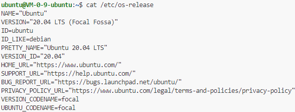

查看 Git 版本：

```bash
git --version
```

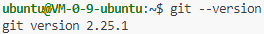

查看 Python 版本：

```bash
python --version
```

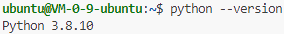

克隆 GitHub 仓库：

```bash
git clone https://github.com/MinmusLin/Miel_Link
```

配置 Docker：

```bash
chmod +x Miel_Link/scripts/docker_install.sh
Miel_Link/scripts/docker_install.sh
```

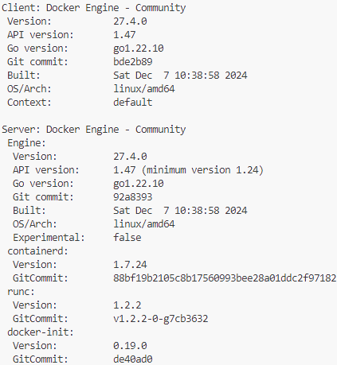

配置 Docker 用户组：

```bash
sudo usermod -aG docker $USER
newgrp docker
```

启动 Docker 服务：

```bash
sudo systemctl daemon-reload
sudo systemctl restart docker
sudo systemctl status docker
```


配置 Golang：

```bash
wget https://golang.google.cn/dl/go1.19.linux-amd64.tar.gz
sudo tar -C /usr/local -xzf go1.19.linux-amd64.tar.gz
rm go1.19.linux-amd64.tar.gz
mkdir $HOME/go
```

编辑 `~/.bashrc` 文件：

```bash
nano ~/.bashrc
```

在 `~/.bashrc` 文件末尾添加：

```
export GOPATH=$HOME/go
export GOROOT=/usr/local/go
export PATH=$GOROOT/bin:$PATH
export PATH=$GOPATH/bin:$PATH
```

更新环境变量：

```bash
source  ~/.bashrc
```

查看 Golang 版本：

```bash
go version
```

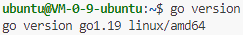

启用 Go 的模块支持：

```bash
go env -w GO111MODULE=on
```

配置 NVM：

```bash
chmod +x Miel_Link/scripts/nvm_install.sh
Miel_Link/scripts/nvm_install.sh
```

更新环境变量：

```bash
source  ~/.bashrc
```

查看 NVM 版本：

```bash
nvm --version
```

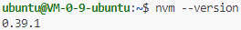

配置 Node.js：

```bash
nvm install 16
```

查看 Node.js 版本：

```bash
node -v
```

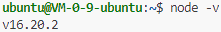

查看 npm 版本：

```bash
npm -v
```

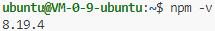

配置 Jq：

```bash
sudo apt install jq
```

编辑 `/etc/sysctl.conf` 文件：

```bash
sudo nano /etc/sysctl.conf
```

在 `/etc/sysctl.conf` 文件末尾添加：

```
fs.inotify.max_user_watches=524288
```

应用更改：

```bash
sudo sysctl -p
```

检查当前文件监视器数量：

```bash
cat /proc/sys/fs/inotify/max_user_watches
```

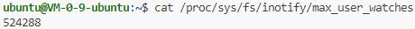

下载 Hyperledger Fabric 镜像：

```bash
Miel_Link/blockchain/network/install-fabric.sh
```

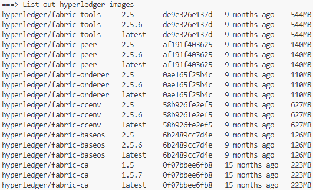

配置 Ngnix：

```bash
sudo apt update
sudo apt install nginx
sudo systemctl start nginx
sudo systemctl enable nginx
```

编辑 `/etc/nginx/sites-available/default` 文件：

```bash
sudo nano /etc/nginx/sites-available/default
```

```
server {
    listen 80;
    server_name {server_ip};

    location / {
        proxy_pass http://127.0.0.1:3000;
        proxy_set_header Host $host;
        proxy_set_header X-Real-IP $remote_addr;
        proxy_set_header X-Forwarded-For $proxy_add_x_forwarded_for;
        proxy_set_header X-Forwarded-Proto $scheme;
    }
}
```

测试 Nginx 配置：

```bash
sudo nginx -t
```

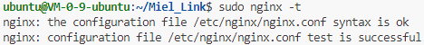

重启 Nginx 服务：

```bash
sudo systemctl restart nginx
```

</details>

## 启动程序

服务器开放端口 22、80、8080、9090：

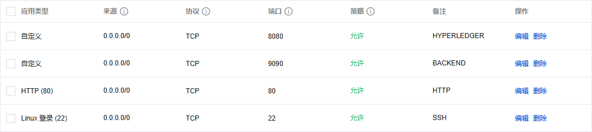

进入项目目录：

```bash
cd Miel_Link
```

启动区块链网络：

```bash
cd blockchain/network
./start.sh
```

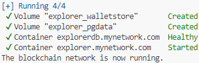

关闭区块链网络：

```bash
cd blockchain/network
./stop.sh
```

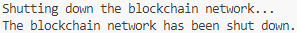

启动后端应用程序：

```bash
cd application/backend
go run main.go
```

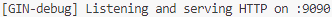

启动前端应用程序：

```bash
cd application/frontend
npm install # or `pnpm install`
npm run dev
```

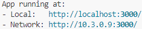

## 免责声明

The code and materials contained in this repository are intended for personal learning and research purposes only and may not be used for any commercial purposes. Other users who download or refer to the content of this repository must strictly adhere to the **principles of academic integrity** and must not use these materials for any form of homework submission or other actions that may violate academic honesty. I am not responsible for any direct or indirect consequences arising from the improper use of the contents of this repository. Please ensure that your actions comply with the regulations of your school or institution, as well as applicable laws and regulations, before using this content. If you have any questions, please contact me via [email](mailto:minmuslin@outlook.com).

本仓库包含的代码和资料仅用于个人学习和研究目的，不得用于任何商业用途。请其他用户在下载或参考本仓库内容时，严格遵守**学术诚信原则**，不得将这些资料用于任何形式的作业提交或其他可能违反学术诚信的行为。本人对因不恰当使用仓库内容导致的任何直接或间接后果不承担责任。请在使用前务必确保您的行为符合所在学校或机构的规定，以及适用的法律法规。如有任何问题，请通过[电子邮件](mailto:minmuslin@outlook.com)与我联系。

## 文档更新日期

2024年12月16日